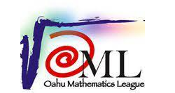

## What is Science Olympiad?
In my sophomore year of high school, I joined Science Olympiad, a science competition that pits students against other students of different schools. It consists of multiple science events that rotate every few years. The events include astronomy, chem-lab, mousetrap vehicle, thermodynamics, ornithology, model bridge building, and many more. Each student would be put in around 3 to 4 events to compete. Science Olympiad is a place for students to showcase their skills and hard work in many events that they participated in. It is also a place to learn and try new things.
## What I Did and The Lessons I learned
The events that I competed in were chem-lab, mousetrap vehicle, and astronomy but my most memorable event out of the tree was mousetrap vehicle. It was my favorite event. In the mousetrap vehicle event, before the competition, you work in a team of 2 to design a small car that does a certain task and the only energy source it uses are mousetraps. For example, I remembered one of the tasks was to use the car to move a cup closest to a point, leave the cup there, and return the car to the starting position. Initially, me and my teammate build our own car and see which one performs the task more accurately. My car was chosen in the end and afterwards, we would modify it so that it would be more accurate than before. In the competition, because I was the most familiar with the car, my job was to wound up the wheel so that it would move and stop where it is supposed to and my partner’s job was to align the car and set it off. We didn’t win any medals that year for that event but the year after that we did manage to get a bronze medal (3rd place) in an invitational competition (not an official competition but a sort of practice one). The mousetrap vehicle event taught me that teamwork is important.
In my senior year of high school, the event mousetrap vehicle rotated out and the new event gravity vehicle replaced the old one. This event is similar to the mousetrap vehicle event but the only difference is that instead of using mousetraps to power the car, you use a ramp and let gravity do all the work. The task also changed to stop the car as close to the targeted point as possible. Here, I learned my second lesson: don’t work hard, work smart. Instead of designing a brand new car from scratch, I decided to repurpose my old car from the mousetrap vehicle event so that it works with this event. This way, I would have more time fine tuning how accurate the car is when it stops. Eventually, when it was time for the official regional competition, I placed second and got myself a silver medal.

	

Source: [Science Olympiad main home page](https://www.soinc.org)
