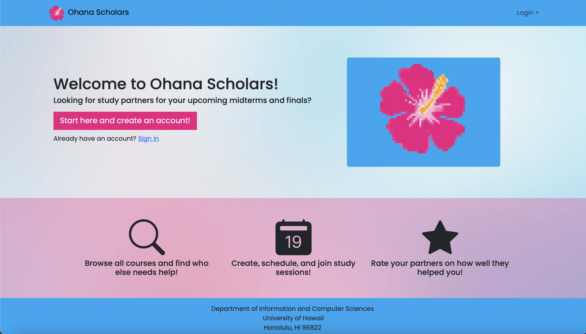
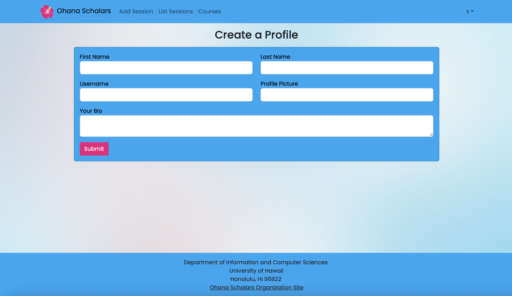
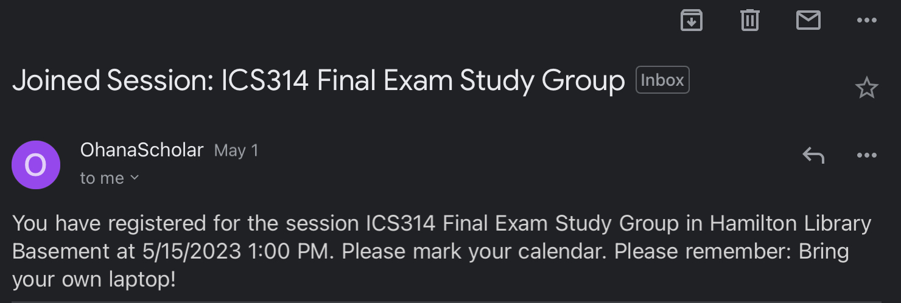

## What is Ohana Schoolars?
In my fourth semester of college, I help create a web application named Ohana Scholars with  Alden Paroni, Audrey Soares, Mark Burgess, and Christopher Pascual. Ohana Scholars’ main purpose is to schedule study groups for its users. It is an online application that allows users to sign in, create a profile, and create or join a study session. The application would then send a confirmation email to the registered email address. 

## How I Contributed
For this project, I made the create profile page and the edit profile page, improved upon the list user admin page, and created the automatic email confirmation system (only works for at most 5 selected users because I am using the free version of an application called Mailgun). 

     

     
## What I Learned
One lesson I’ve learned from working on this project is how important it is to get help from others. When I am stuck on a particular problem for a long time, I find it easier to have a fresh set of eyes to look at the problem and can spot things that I overlooked. A new set of perspectives could go a long way.

To learn more, visit [Ohana Scholar project home page](https://ohana-scholars.github.io).
